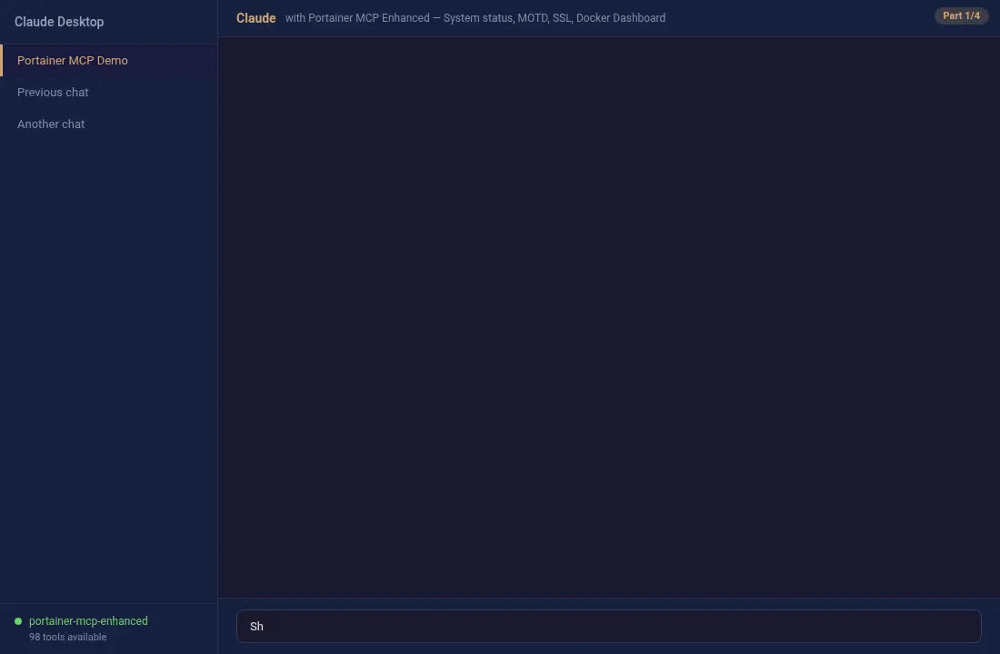
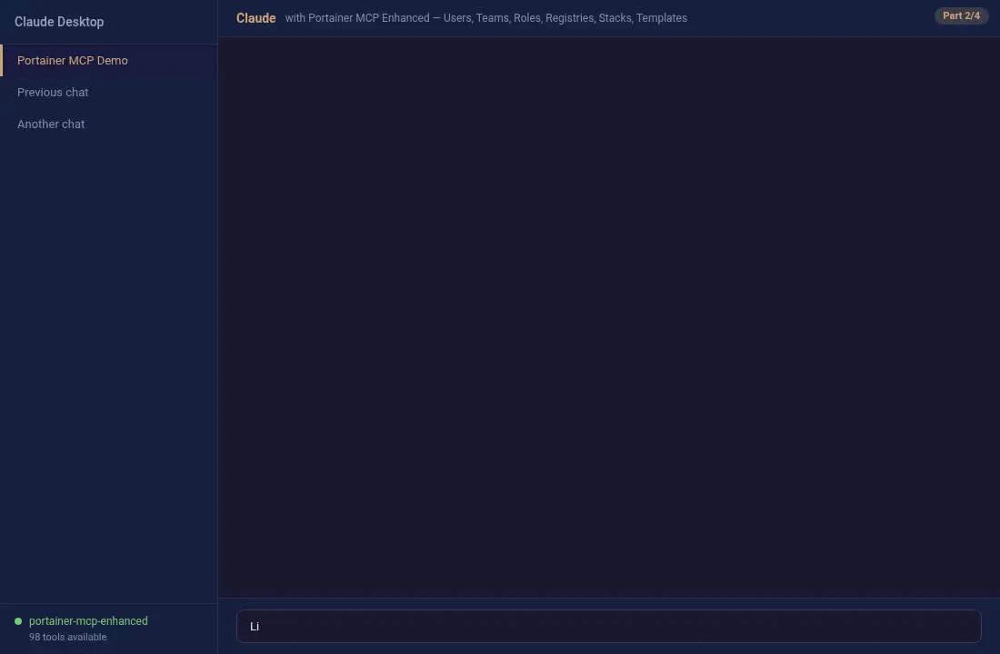
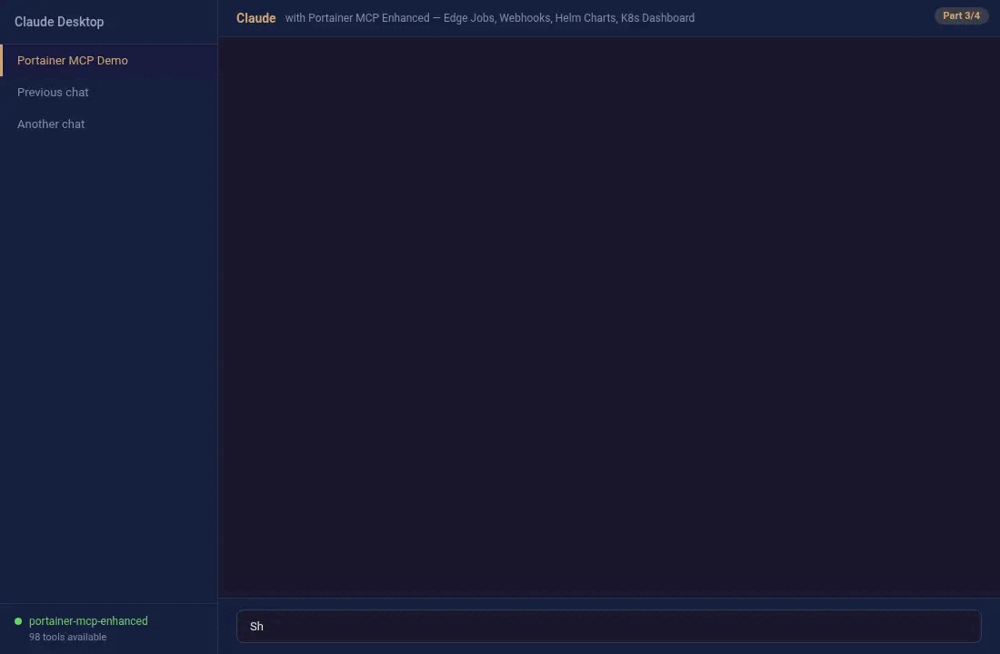
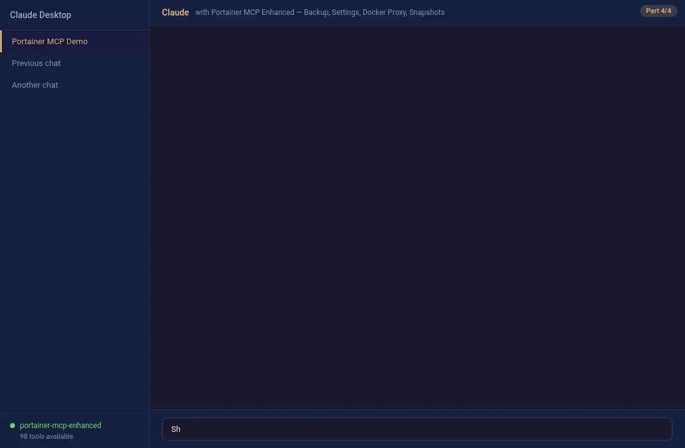

<div align="center">

# Portainer MCP Server (Enhanced)

**Enhanced community fork — Manage your entire Portainer infrastructure through AI assistants using the Model Context Protocol**

> ⚡ This is an enhanced fork of the [official Portainer MCP Server](https://github.com/portainer/portainer-mcp) with additional features and improvements.


[Documentation](https://jmrplens.github.io/portainer-mcp-enhanced/) · [Quickstart](#quickstart) · [Configuration](#configuration) · [Contributing](CONTRIBUTING.md)

</div>

---

A [Model Context Protocol (MCP)](https://modelcontextprotocol.io/introduction) server that connects AI assistants to [Portainer](https://www.portainer.io/) — exposing **98 tools** covering the complete Portainer API. Manage environments, stacks, users, teams, registries, Kubernetes, Helm, Docker, edge computing, backups, and more through natural language.

<details open>
<summary><b>🖥️ System & Docker Dashboard</b></summary>


</details>

<details>
<summary><b>👥 Users, Teams & Stacks</b></summary>


</details>

<details>
<summary><b>🌐 Edge & Kubernetes</b></summary>


</details>

<details>
<summary><b>💾 Backup & Docker Proxy</b></summary>


</details>

## Quickstart

### 1. Install

**Go install**:
```bash
go install github.com/jmrplens/portainer-mcp-enhanced/cmd/portainer-mcp-enhanced@latest
```

**Docker**:
```bash
docker pull ghcr.io/jmrplens/portainer-mcp-enhanced:latest
```

**From source**:
```bash
git clone https://github.com/jmrplens/portainer-mcp-enhanced.git
cd portainer-mcp-enhanced
make build    # → dist/portainer-mcp-enhanced
```

Or download a pre-built binary from [Releases](https://github.com/jmrplens/portainer-mcp-enhanced/releases/latest) (Linux, macOS, Windows — amd64/arm64, with SHA256 checksums).

### 2. Get a Portainer API Token

1. Log in to your Portainer instance → **My Account** → **API Keys**
2. Create a new key and copy the token

### 3. Configure your AI assistant

<details open>
<summary><b>Claude Desktop</b></summary>

Edit `~/Library/Application Support/Claude/claude_desktop_config.json` (macOS) or `%APPDATA%\Claude\claude_desktop_config.json` (Windows):

```json
{
  "mcpServers": {
    "portainer": {
      "command": "/path/to/portainer-mcp-enhanced",
      "args": [
        "-server", "https://your-portainer:9443",
        "-token", "ptr_your_api_token"
      ]
    }
  }
}
```
</details>

<details>
<summary><b>VS Code (GitHub Copilot)</b></summary>

Create `.vscode/mcp.json` in your workspace:

```json
{
  "servers": {
    "portainer": {
      "type": "stdio",
      "command": "/path/to/portainer-mcp-enhanced",
      "args": [
        "-server", "https://your-portainer:9443",
        "-token", "ptr_your_api_token"
      ]
    }
  }
}
```
</details>

<details>
<summary><b>Cursor</b></summary>

Go to **Cursor Settings → MCP** and add:

```json
{
  "mcpServers": {
    "portainer": {
      "command": "/path/to/portainer-mcp-enhanced",
      "args": [
        "-server", "https://your-portainer:9443",
        "-token", "ptr_your_api_token"
      ]
    }
  }
}
```
</details>

### 4. Start asking

> "List all environments and their status"  
> "Create a new nginx stack from this compose file"  
> "Show me the Kubernetes dashboard for environment 3"

## Configuration

| Flag | Description | Required | Default |
|------|-------------|----------|---------|
| `-server` | Portainer server URL | **Yes** | — |
| `-token` | Portainer API token | **Yes** | — |
| `-tools` | Path to custom tools.yaml | No | Embedded |
| `-read-only` | Disable all write/delete operations | No | `false` |
| `-granular-tools` | Register all 98 individual tools instead of 15 grouped meta-tools | No | `false` |
| `-disable-version-check` | Skip Portainer version validation | No | `false` |
| `-skip-tls-verify` | Skip TLS certificate verification | No | `false` |

### Meta-Tools (Default Mode)

By default the server registers **15 grouped meta-tools** instead of the 98 individual granular tools. Each meta-tool covers a functional domain and exposes an `action` parameter (enum) that routes to the appropriate handler.

This dramatically reduces the tool-selection surface for LLMs while preserving 100% of the underlying functionality.

| Meta-Tool | Actions | Description |
|-----------|---------|-------------|
| `manage_environments` | 16 | Environments, environment groups, tags |
| `manage_stacks` | 13 | Regular and compose stacks |
| `manage_access_groups` | 7 | Access group CRUD and user/team access policies |
| `manage_users` | 5 | User CRUD and role management |
| `manage_teams` | 6 | Teams and team membership |
| `manage_docker` | 2 | Docker proxy and dashboard |
| `manage_kubernetes` | 5 | Kubernetes proxy, namespaces, config, dashboard |
| `manage_helm` | 8 | Helm repos, charts, releases |
| `manage_registries` | 5 | Container registry management |
| `manage_templates` | 7 | Custom and app templates |
| `manage_backups` | 5 | Backup, restore, S3 settings |
| `manage_webhooks` | 3 | Webhook CRUD |
| `manage_edge` | 6 | Edge jobs and update schedules |
| `manage_settings` | 5 | Server settings and SSL |
| `manage_system` | 5 | Version, status, MOTD, roles, auth |

To use the original 98 individual tools, pass `--granular-tools`. See the [Meta-Tools Guide](https://jmrplens.github.io/portainer-mcp-enhanced/guides/meta-tools/) for the full action reference.

### Read-Only Mode

Run with `-read-only` to restrict to read-only operations. All write, update, and delete actions are disabled — ideal for monitoring and observation. Works with both meta-tools and granular tools modes.

### Version Compatibility

| MCP Server | Supported Portainer |
|------------|-------------------|
| v0.7.x | 2.39.1 |
| v0.6.x | 2.31.2 |
| v0.5.x | 2.30.0 |
| v0.4.x | 2.27.4 |

## Documentation

📖 **[Full Documentation](https://jmrplens.github.io/portainer-mcp-enhanced/)** — Installation, configuration, meta-tools guide, architecture, security, and API reference.

| Page | Description |
|------|-------------|
| [Getting Started](https://jmrplens.github.io/portainer-mcp-enhanced/getting-started/) | Prerequisites, installation, AI assistant setup |
| [Configuration](https://jmrplens.github.io/portainer-mcp-enhanced/configuration/) | CLI flags, tool modes, version compatibility |
| [Meta-Tools Guide](https://jmrplens.github.io/portainer-mcp-enhanced/guides/meta-tools/) | All 15 meta-tools with complete action reference |
| [Tools Reference](https://jmrplens.github.io/portainer-mcp-enhanced/reference/api-reference/) | All 98 granular tools with parameters |
| [Architecture](https://jmrplens.github.io/portainer-mcp-enhanced/reference/architecture/) | Server layers, client model, project structure |
| [Security](https://jmrplens.github.io/portainer-mcp-enhanced/guides/security/) | Authentication, TLS, read-only mode, proxy safety |
| [Contributing](https://jmrplens.github.io/portainer-mcp-enhanced/development/contributing/) | Development setup, code style, adding new tools |

## Development

```bash
make build                    # Build binary
make test                     # Unit tests
make test-integration         # Integration tests (requires Docker)
make test-all                 # All tests
make inspector                # Launch MCP Inspector UI
```

See [CONTRIBUTING.md](CONTRIBUTING.md) for development guidelines. The [Developer Documentation](https://jmrplens.github.io/portainer-mcp-enhanced/development/contributing/) covers project structure, adding tools, testing, dependencies, and CI/CD in detail.

### End-to-end (e2e) testing

`test/e2e` provisions a real, disposable Portainer estate — two servers (Community and, when a
licence is available, Business Edition), a Portainer agent, an edge agent, and a Kubernetes leg in
k3d — and drives every action under test against it over the actual MCP transport, not mocks.
Everything runs on its own Docker-in-Docker daemon, so it never touches the host's containers or
its Docker socket.

```bash
make e2e-up        # bring the compose estate up from empty (~25s)
make e2e-k8s-up     # additionally bring up the k3d/Kubernetes leg (~2 min); needs k3d, kubectl, helm
make test-e2e       # run the e2e suite against the live estate (go test -tags e2e)
make e2e-k8s-down    # tear the Kubernetes leg down
make e2e-down        # tear the compose estate down
```

`make e2e-up` and `make e2e-down` need only Docker and Docker Compose. `make e2e-k8s-up` /
`make e2e-k8s-down` additionally need `k3d`, `kubectl` and `helm` on `PATH` — the scripts fail with
a named message if any is missing rather than doing something partial.

### Running the estate on another machine

The estate normally runs on the Docker daemon of the machine you are on. Set one key in the
gitignored `.env` at the repository root to run it somewhere else instead:

```dotenv
PORTAINER_E2E_DOCKER_SSH=truenas
```

The value is an SSH destination — a `Host` from your `~/.ssh/config`, or `user@host`. Key-based,
passphrase-free authentication is required: the scripts pass `BatchMode=yes` and will fail rather
than prompt.

**Setting the key changes nothing on its own.** `make e2e-up` and `make e2e-k8s-up` always use the
local Docker daemon, whatever `.env` says — this is a direct requirement from the repository
owner: a distracted `make e2e-up` must never reach their production NAS. Remote runs need their
own targets, and each fails loudly and creates nothing if `PORTAINER_E2E_DOCKER_SSH` is unset,
rather than silently falling back to local:

```bash
make e2e-up-remote        # the compose legs, on the remote host
make e2e-k8s-up-remote    # the Kubernetes leg — can legitimately be a different host
```

Teardown takes no flag. `up` records where it went — `test/e2e/.docker-host` for the compose legs,
`test/e2e/.docker-host-kubernetes` for the Kubernetes leg, kept separate because the two legs can
end up on different machines — and `make e2e-down` / `make e2e-k8s-down` read that marker back, so
the ordinary sequence works unchanged regardless of where anything actually ran:

```bash
make e2e-up-remote && make e2e-k8s-up-remote
go test -tags e2e -timeout 15m -count=1 ./test/e2e/suite/...
make e2e-k8s-down && make e2e-down
```

Ports are forwarded back over SSH, so `http://localhost:19000`, `http://localhost:19001` and the
`k3d-portainer-mcp-e2e` kube context mean the same thing they do locally. The Kubernetes leg needs
*two* forwards, not one. The k3s API port is pinned with `--api-port` (rather than left for k3d to
choose at random) because the tunnel has to be told which port to forward before the cluster even
exists — and once it is forwarded, `kubectl` is pointed at `https://127.0.0.1:<api_port>` rather than
whatever host k3d would otherwise write into the kubeconfig, because the k3s serving certificate
covers `127.0.0.1` and not the SSH alias or the host's LAN address. Portainer's own NodePort is a
second, separate forward, added once Helm creates the Service: the in-cluster server registers itself
at `server_ip:nodeport`, an address only the Docker host itself can reach, and the tunnel is the only
route this process — which may not be the Docker host — has to it. That forward carries no
certificate concern of its own; the in-cluster Portainer's self-signed certificate is read out of the
running pod and pinned separately (see `fetch_k8s_ca` in `test/e2e/scripts/lib.sh`).

**This needs TCP forwarding enabled on the remote sshd** — check with
`ssh <dest> 'sshd -T | grep -i allowtcpforwarding'`. It is off by default on some appliance
operating systems, TrueNAS among them, where every tunnel died with `connection reset by peer`
while the same port answered fine from the remote's own loopback. The persistent fix there is
`midclt call ssh.update '{"tcpfwd": true}'` — editing `/etc/ssh/sshd_config` directly does not
survive, because the middleware regenerates that file on its own.

Nothing on the remote host outside the `portainer-mcp-e2e` compose project and the
`portainer-mcp-e2e` k3d cluster is touched, and the one file written outside them — the CDI
specification under `/tmp` — is removed by teardown.

**GPUs.** If the remote host has an NVIDIA card, the estate finds it and offers it to both legs, with
different levels of confidence. The Docker leg is confirmed end to end: the containers Portainer
manages get the card through a hookless CDI specification bind-mounted into the estate's own dind
(nested `--gpus` cannot work there — see `docs/api-divergences.md`), and a container that requests it
reports the real device. That leg's override (`test/e2e/docker-compose.gpu.yml`, applying the `gpus:`
key) needs Docker Compose v2.30 or newer on the Docker host — an older Compose does not understand
the key. The Kubernetes leg is confirmed only as far as **node capacity** — the k3s
node advertises `nvidia.com/gpu`, which is the fact `GetKubernetesGPUInfo` reads — not as far as
running a workload through it: a pod that *claims* the GPU still fails at container creation with
`unresolvable CDI devices …`, an open item recorded in `docs/api-divergences.md` §10.3. No extra key
is needed for either leg — pointing the estate at a machine with a card is the whole opt-in. `--gpus
all` is only ever passed to `k3d cluster create` when a card AND a working NVIDIA Container Toolkit
were both actually detected: on a host with the driver but no toolkit at all, passing it unconditionally
fails the whole cluster with `failed to discover GPU vendor from CDI: no known GPU vendor found`.
Suites that need a GPU skip with a named reason everywhere else, so running locally stays exactly as
fast as it was.

**Docker Swarm.** `make e2e-up` also puts the estate's own dind into Swarm mode and creates one
long-lived fixture service (`portainer-mcp-e2e-swarm-probe`, `busybox sleep`), so Swarm-dependent
catalog actions — `docker.service_image_status` today — have something real to exercise instead of
the plain-engine 500 they get without it. The Swarm init and fixture-service steps are themselves
idempotent: running either again against a daemon that already has them reuses what exists rather than
failing on Docker's own "already part of a swarm"/"name conflicts with an existing object". That does
not extend to `make e2e-up` as a whole — the provisioner it runs afterwards unconditionally calls
`POST /users/admin/init`, which an already-initialized Portainer refuses, so a second `make e2e-up`
with no intervening `make e2e-down` still fails at that step regardless of the Swarm leg's own
idempotency. Like the GPU leg, Swarm needs no extra key — it is attempted unconditionally — and
degrades the same way: a host where `docker swarm init` is refused for any reason gets a warning, not
an aborted `make e2e-up`, and Swarm-dependent suites skip via `harness.Estate.HasSwarm()` instead of
failing. `make e2e-down` destroys the dind container wholesale and passes compose's own `-v` when it
does (`test/e2e/scripts/down.sh`), taking the swarm and the fixture service with it: `docker:28-dind`
declares `/var/lib/docker` as a volume, so without `-v` that state would survive in an anonymous volume
across the container's removal — `-v` is what actually makes there nothing extra to release or clean
up at teardown, not the container's writable layer alone.

**Business Edition licence.** Business Edition and the edge-only domains need a licence key in a
gitignored `.env` at the repository root (see `.env.example`):

```dotenv
PORTAINER_LICENSE=your-business-edition-key
```

Without it, `make e2e-up` still provisions the Community Edition leg; suites that need Business
Edition skip with a named reason instead of failing. The licence is released back
(`POST /licenses/remove`) from every server that attached it — compose EE and the Kubernetes leg
alike — before that server's container is destroyed, on both the success and the failure path, so
no run keeps a licence attached past its own teardown. `make e2e-licence-release` recovers a licence
left stranded by a run that crashed before it could release: it attaches the licence to a throwaway
server and releases it immediately, and is safe to run even when nothing is actually stranded.

**In CI** (`.github/workflows/e2e.yml`), the same is true: a pull request from a fork has no access
to the `PORTAINER_LICENSE` repository secret, so the workflow logs that Community Edition legs only
will run and creates no `.env` at all — the Business Edition legs then skip with that same named
reason, and the build does not go red for a secret a contributor cannot supply. When the secret is
available, the key is written to `.env` from the environment, never as a
command-line argument or an echoed value, and the file is removed on every exit path, including a
failed run.

### Security

To report a vulnerability, see [SECURITY.md](SECURITY.md). Please use **private disclosure** — do not open public issues for security bugs.

## License

Copyright (c) 2025 Portainer.io — See [LICENSE](LICENSE) for details.
